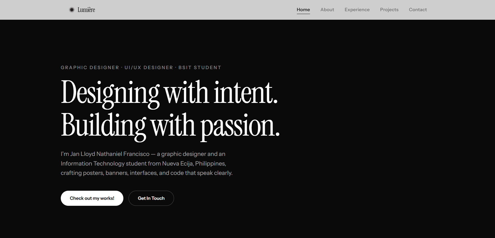

# Lumière

A personal one-page portfolio made in React as a Midterm Lab Project for **ITELEC 4100**.

**Live demo:** [lumiere-nine-iota.vercel.app](https://lumiere-nine-iota.vercel.app/)



## Sections

- **Home** — intro and call to action
- **About** — bio, skills, and education timeline
- **Experience** — organizations and roles
- **Projects** — filterable grid (All / UI-UX / Code / Graphic Design) spanning real code projects (with links to GitHub), UI/UX work, and graphic design pieces (posters, banners, social media graphics)
- **Contact** — social links and a working contact form

## Tech Stack

- [React 19](https://react.dev/) + [Vite](https://vite.dev/)
- [Tailwind CSS v4](https://tailwindcss.com/) with custom CSS on top
- [Oxlint](https://oxc.rs/) for linting

## Getting Started

```bash
npm install
npm run dev
```

The app runs at `http://localhost:5173`.

### Other scripts

```bash
npm run build    # production build
npm run preview  # preview the production build locally
npm run lint     # lint the codebase
```

## Project Structure

```
src/
  components/   # functional components (Navbar, Hero, About, Experience, Projects, Contact, ...)
  data/         # content: projects, skills, education, experience, socials, nav
  hooks/        # useActiveSection (scroll-spy), useReveal (scroll animations)
  assets/img/   # optimized WebP images
```

## License

MIT — see [LICENSE](LICENSE).
